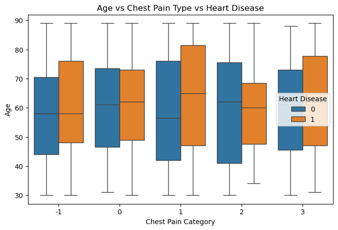
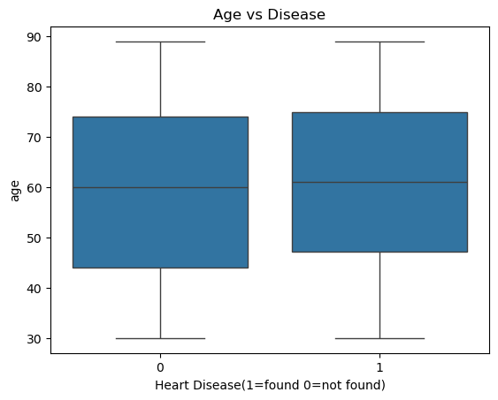
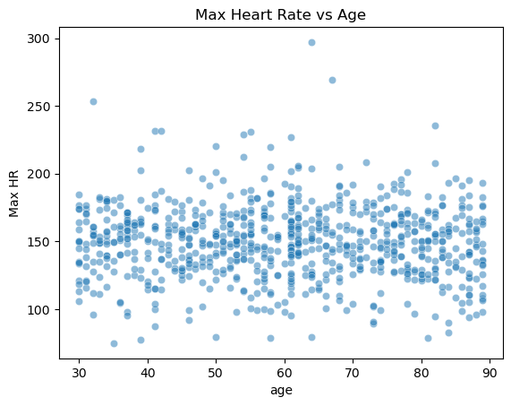

# Heart-Disease-Prediction
In this project, I cleaned a dirty heart disease patient dataset and performed EDA. I analyzed which parameters are vital to heart diseases, which may help doctors in their medical purposes. I also performed a small Machine Learning Model Analysis task.
# Objective
1. Finding patterns related to heart disease patients.
2. Analyzing the effect of different physiological parameters that may define heart disease in patients.
3. Analyzing abnormal values of heart and body-related aspects for non-diseased patients.
# Dataset
* Source: Kaggle
* Contains medical attributes of patients
### Key Features:
- Age → Age of patient
- Gender → (1 = male, 0 = female)
- Chest Pain Type
- Resting Blood Pressure
- Cholesterol level
- Maximum heart rate achieved
- Exercise-induced angina
- ST depression
- Heart Disease → 1 = disease, 0 = no disease
# Data Cleaning
1. Handled missing values (filled with median/mode or labeled as -1 = unknown)
2. Converted data types (numeric columns fixed)
3. Removed inconsistencies and duplicates
4. Standardized column names
# Exploratory Data Analysis (EDA)
### Univariate Analysis:
1. Distribution of age, cholesterol, and heart rate
2. Count plots for categorical features (sex, chest pain type)
### Bivariate Analysis:
1. Age vs Heart Disease
2. Cholesterol vs Heart Disease
3. Max Heart Rate vs Heart Disease
4. ST Depression vs Heart Disease
5. Correlation heatmap

AND MORE!

### Multivariate Analysis:

1. ST depression and Blood Pressure relation with heart disease
2. Cholesterol and Heart Rate with Chest Pain Type
3. Age vs Chest Pain Type vs Heart Disease

AND MORE!

# Machine Learning
### Models Used:
1. Logistic Regression
2. Decision Tree
3. K-Nearest Neighbors (KNN)
### Evaluation Metrics:
1. Accuracy
2. Precision
3. Recall
4. F1 Score

# Key Insights:
1. It is not an exaggeration to say that age group 55-65 is seen to have the most heart disease cases.
2. No specific factor alone can be determinant for heart diseases.
3. Certain chest pain types are highly predictive.
4. Heart parameters are less likely to influence one another.
5. High cholesterol and low ST depression value suggest heart disease more than any other combination.
# Images
### Age vs Chest Pain Type vs Disease

* Certain chest pain types (such as cp = 1 and cp = 3) show slightly higher median ages for patients with heart disease.
---
### Age vs Disease

* Approximately the same number of disease and non-disease patients with a similar age group were found. This concludes that age doesn't strongly define whether a patient has heart disease or not.
---
### Age vs Max Heart Rate

* Heart rates vary for each age group, i.e., no specific pattern found between age groups with a specific range of heart rates.
---
# Author
Pritom Paul Supto -
GitHub: https://github.com/prit564
